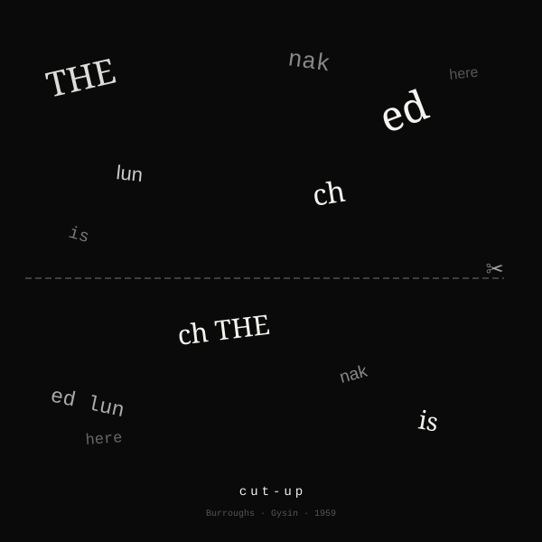
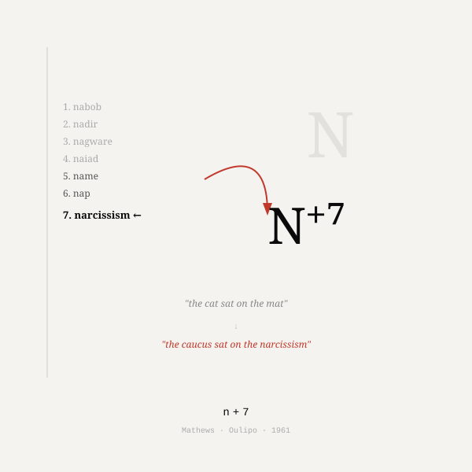
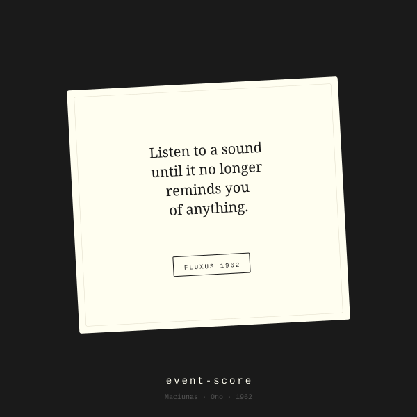
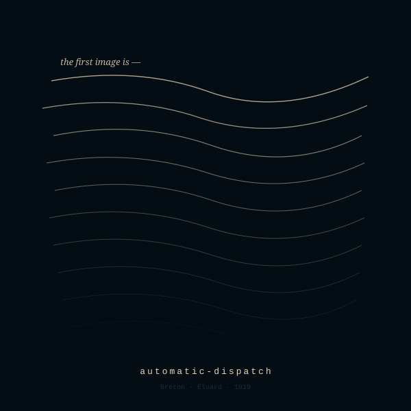
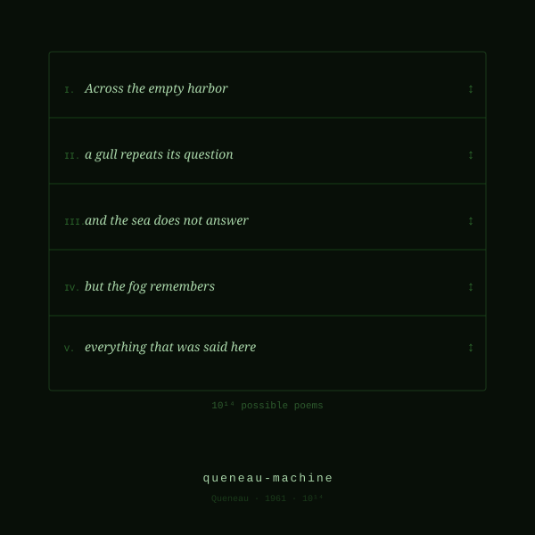
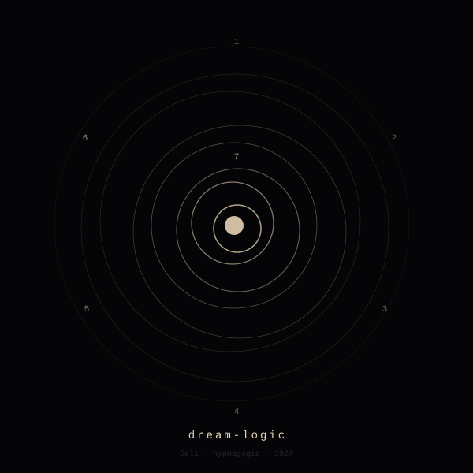
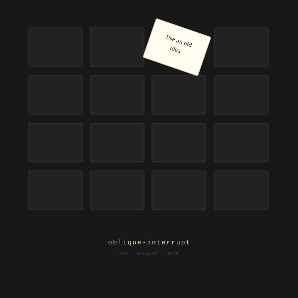
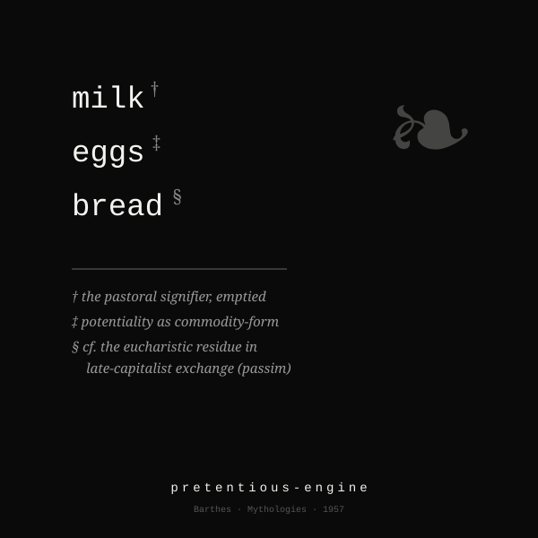

# Oblique Techniques

```
O  B  L  I  Q  U  E
- - - - - - - - - /
T  E  C  H  N  I  Q  U  E  S
```

The machine has read everything.
It has read Middlemarch and the Pepsi can and your ex's substack
and the entire archive of the Paris Review.
It's very, very good at sounding like all of it at once.

Noam Chomsky called it a plagiarism machine.
He's not wrong.

---

But the real problem isn't that it's derivative.
It's that it's *meh* — every output aimed at the statistical
center of everything that's ever been written.

You don't fix that by arguing with it.
You fix it by handing it a constraint it wasn't built for
and seeing what survives.

That's this repo.
Free /skills, on purpose — because the fastest way to kill
the slop is to give people something more interesting to do instead.

---

**Oblique Techniques** is a collection of stratagems
for people who think the default output is the problem,
not the solution.

Not productivity tools.
Not prompt libraries.
Not AI magic tricks for your quarterly review.

Stratagems.
Calculated moves against a system that wants to give you
the most statistically likely next word.

---

## The collection

<table>
<tr>
<td align="center" width="33%">
  <a href="./skills/cut-up/"><br><b>cut-up</b></a><br>
  <sub>Scissors for people who don't own scissors. The text knew all along — it was just waiting to be rearranged.</sub>
</td>
<td align="center" width="33%">
  <a href="./skills/n+7/"><br><b>n+7</b></a><br>
  <sub>Every noun, marched seven entries down the dictionary. The sentence survives. Mostly.</sub>
</td>
<td align="center" width="33%">
  <a href="./skills/exquisite-corpse/"><br><b>exquisite-corpse</b></a><br>
  <sub>The parlor game, except you play blind and the machine keeps the fold. For once it knows something you don't, and it's your poem.</sub>
</td>
</tr>
<tr>
<td align="center" width="33%">
  <a href="./skills/event-score/"><br><b>event-score</b></a><br>
  <sub>One to four lines of instruction. May be impossible. Still due Friday.</sub>
</td>
<td align="center" width="33%">
  <a href="./skills/automatic-dispatch/"><br><b>automatic-dispatch</b></a><br>
  <sub>First thought, only thought. No transitions, no apologies, no adult supervision.</sub>
</td>
<td align="center" width="33%">
  <a href="./skills/détournement/"><br><b>détournement</b></a><br>
  <sub>Your text, but it defected. Using only its own words. The audacity.</sub>
</td>
</tr>
<tr>
<td align="center" width="33%">
  <a href="./skills/queneau-machine/"><br><b>queneau-machine</b></a><br>
  <sub>Five versions now. The remaining 99,999,999,999,995 on request.</sub>
</td>
<td align="center" width="33%">
  <a href="./skills/lipogram/"><br><b>lipogram</b></a><br>
  <sub>One letter, exiled. You'll feel the draft coming through the gap.</sub>
</td>
<td align="center" width="33%">
  <a href="./skills/dream-logic/"><br><b>dream-logic</b></a><br>
  <sub>Seven images deep, zero connective tissue. Dalí needed a key and a plate. You need a prompt.</sub>
</td>
</tr>
<tr>
<td align="center" width="33%">
  <a href="./skills/oblique-interrupt/"><br><b>oblique-interrupt</b></a><br>
  <sub>Not advice. Something worse: a non-sequitur that turns out to be correct.</sub>
</td>
<td align="center" width="33%">
  <a href="./skills/entendre-engine/"><br><b>entendre-engine</b></a><br>
  <sub>Finds out what your text has been saying behind your back.</sub>
</td>
<td align="center" width="33%">
  <a href="./skills/pretentious-engine/"><br><b>pretentious-engine</b></a><br>
  <sub>Your grocery list is now a site of contested meaning. You're welcome.</sub>
</td>
</tr>
<tr>
<td align="center" width="33%">
  <a href="./skills/fable/"><br><b>fable</b></a><br>
  <sub>Your hardest concept, but with fur on it. You won't see it coming until the moral does.</sub>
</td>
<td align="center" width="33%"></td>
<td align="center" width="33%"></td>
</tr>
</table>

More coming.
The goal is a hundred.

For lineages, sources, and what's built versus pending, see [CATALOG.md](./CATALOG.md).

---

## Install

One stratagem:

```bash
curl -fsSL https://raw.githubusercontent.com/saren-ai/oblique-techniques/main/install.sh | bash -s -- cut-up
```

A starting set:

```bash
curl -fsSL https://raw.githubusercontent.com/saren-ai/oblique-techniques/main/install.sh | bash -s -- @starter
```

By lineage:

```bash
curl -fsSL https://raw.githubusercontent.com/saren-ai/oblique-techniques/main/install.sh | bash -s -- @surrealist
curl -fsSL https://raw.githubusercontent.com/saren-ai/oblique-techniques/main/install.sh | bash -s -- @oulipo
curl -fsSL https://raw.githubusercontent.com/saren-ai/oblique-techniques/main/install.sh | bash -s -- @fluxus
```

All of them:

```bash
curl -fsSL https://raw.githubusercontent.com/saren-ai/oblique-techniques/main/install.sh | bash
```

Stratagems land in `~/.claude/skills/` (override with `OBLIQUE_SKILLS_DIR`). The accented slugs take plain-ASCII aliases — `n7` for `n+7`, `detournement` for `détournement`.

---

## On AI skepticism

You're right to be suspicious.
The thing that generates human-sounding text by predicting
the most likely next token is, in fact, not thinking.
It is doing something stranger and more banal than thinking.

These stratagems don't fix that.
They use it.

The model is just running the machine.
You're still the one making something.

---

Take one. See what it does to your next draft.

*Skills for Liberal Arts Majors. (SLAM)*
