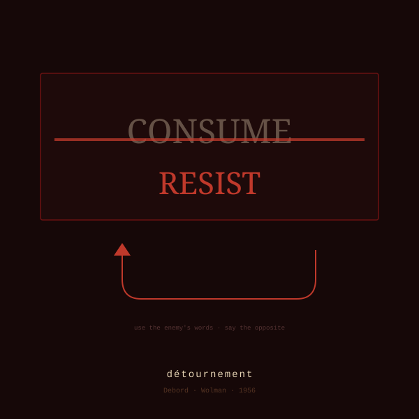

<div align="center">



# détournement

**Debord · Wolman · 1956** · *Situationist*

*Your text, but it defected. Using only its own words.*

</div>

---

Debord and Wolman hijacked comic strips, advertisements, and other
people's prose — kept every word, flipped who the words worked for.
No new vocabulary allowed. The enemy's language is the only material.

Demonstration. Our own manifesto says this collection is for
*people who think the default output is the problem, not the solution.*
Run the move on it:

> the default output is the solution, not the problem.

Same words. Opposite allegiance. Nothing announced.

(Except just now. Announcing the reversal is the one rule this skill
will never break for you — the subversion stays legible but unexplained,
which is what makes it land.)

## Say this

`détournement` · `detournement` · `hijack this` · `turn this against itself`

Feed it slogans, mission statements, anything that's too sure of itself.

## Install

```bash
curl -fsSL https://raw.githubusercontent.com/saren-ai/oblique-techniques/main/install.sh | bash -s -- détournement
```

## In this folder

| file | what it is |
|---|---|
| `SKILL.md` | What Claude reads. The stratagem itself. |
| `skill.yaml` | Manifest — glyph, lineage, voice, triggers. |
| `thumbnail.svg` | The card above. |
| `README.md` | You are here. |

---

<div align="center"><sub>A stratagem in <a href="../../README.md">Oblique Technique</a> — <i>Skills for Liberal Arts Majors. (SLAM)</i></sub></div>
