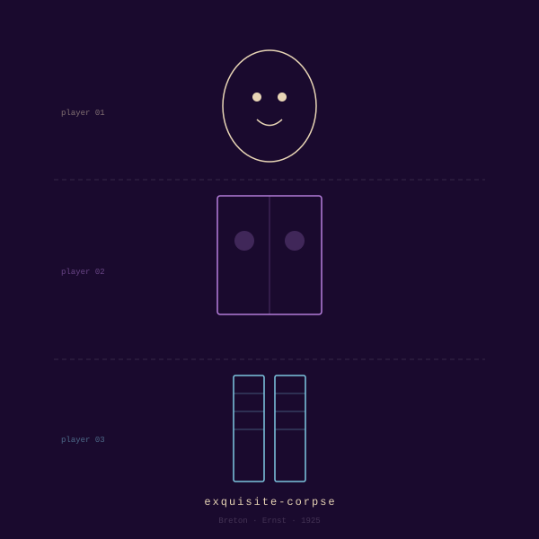

<div align="center">



# exquisite-corpse

**Breton · Ernst · 1925** · *Surrealist*

*You play blind. The machine keeps the fold.*

</div>

---

In 1925 the Surrealists passed a folded paper around a table in Paris.
Each player saw only the previous line, wrote one of their own, and folded again.
The first sentence the game ever produced gave it its name:
*the exquisite corpse shall drink the new wine.*

A century later the problem is reversed.
The machine can't play blind — it holds the whole transcript.
So this version blinds *you* instead. You write a line. The machine answers it,
then drops a curtain:

> •
> •
> •
> •
> •
>
> *…and the lighthouse agreed to keep her secret.*

That's all you get. One line, the one you must answer.
The body stays buried until the reveal — when the whole creature
stands up at once, seams showing, somehow alive.
For once the machine knows something you don't, and it's your poem.

## Say this

`exquisite corpse` · `cadavre exquis` · `start a corpse` · `build a monster`

It will ask who's at the table: just the machine, a ghost of your choosing,
or two strangers who never compare notes.

## Install

```bash
curl -fsSL https://raw.githubusercontent.com/saren-ai/oblique-techniques/main/install.sh | bash -s -- exquisite-corpse
```

## In this folder

| file | what it is |
|---|---|
| `SKILL.md` | What Claude reads. The stratagem itself. |
| `skill.yaml` | Manifest — glyph, lineage, voice, triggers. |
| `thumbnail.svg` | The card above. |
| `README.md` | You are here. |

---

<div align="center"><sub>A stratagem in <a href="../../README.md">Oblique Technique</a> — <i>Skills for Liberal Arts Majors. (SLAM)</i></sub></div>
