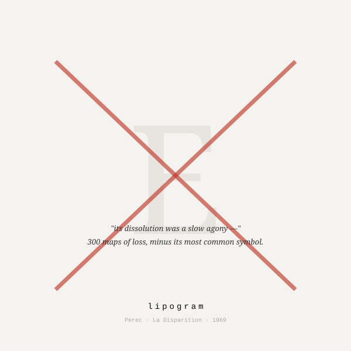

<div align="center">



# lipogram

**Perec · La Disparition · 1969** · *Oulipo*

*A glyph, cast out. Mind that gap.*

</div>

---

A symbol is missing from this card.
Fifth in our ABCs. Most common of all.
From top to bottom of this body copy it isn't found —
not in any word, not in any gap.
Did you spot its omission? Probably not.
Good writing works around a void: it won't limp, it adapts.

In 1969 a Parisian author put out a full book — 300 folios — without it.
A handful of critics didn't spot anything at all.
(His nom contains two of that glyph, so I can't print it.
It's up top, in small print.)

How this skill works: you pick a glyph. From that point on it's contraband.
What you ask for is built without it — and without bragging about it.

## Say this

A command naming your outcast glyph, plus what you want had.
This skill abjurs that glyph from that point on. Fully. No alibis.

## Install

Run this:

```bash
curl -fsSL https://raw.githubusercontent.com/saren-ai/oblique-techniques/main/install.sh | bash -s -- lipogram
```

## On disk

| path | what it is |
|---|---|
| `SKILL.md` | What your AI runs. This is it. |
| `skill.yaml` | Card info — glyph, origin, mood. |
| `thumbnail.svg` | Card art, up top. |
| `README.md` | What you look at right now. |

---

<div align="center"><sub><i>Yes — the filenames, the URL, the lineage line, the markup. Perec had a publisher to argue with; we have a filesystem.</i></sub></div>

<div align="center"><sub>A stratagem in <a href="../../README.md">Oblique Technique</a> — <i>Skills for Liberal Arts Majors. (SLAM)</i></sub></div>
